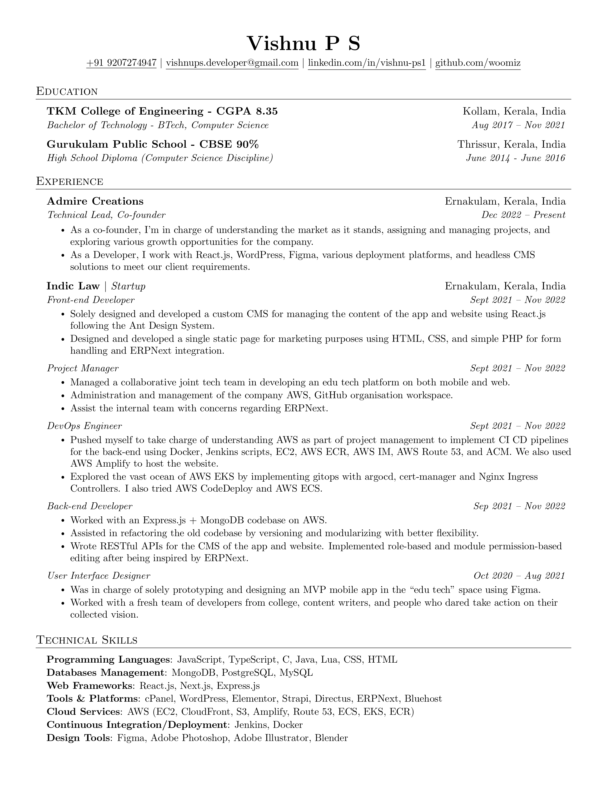

## Resume/CV

My resume/CV written in latex and hot reloaded with the help of `neovim` and `vimtex`.
Full configuration for this setup can be found [here](https://github.com/woomiz/config/tree/master/ubuntu)

- View/Download the generated Resume [pdf](./output/resume.pdf)
- View/Download the generated CV [pdf](./output/cv.pdf)

### Resume

---

### CV

---

